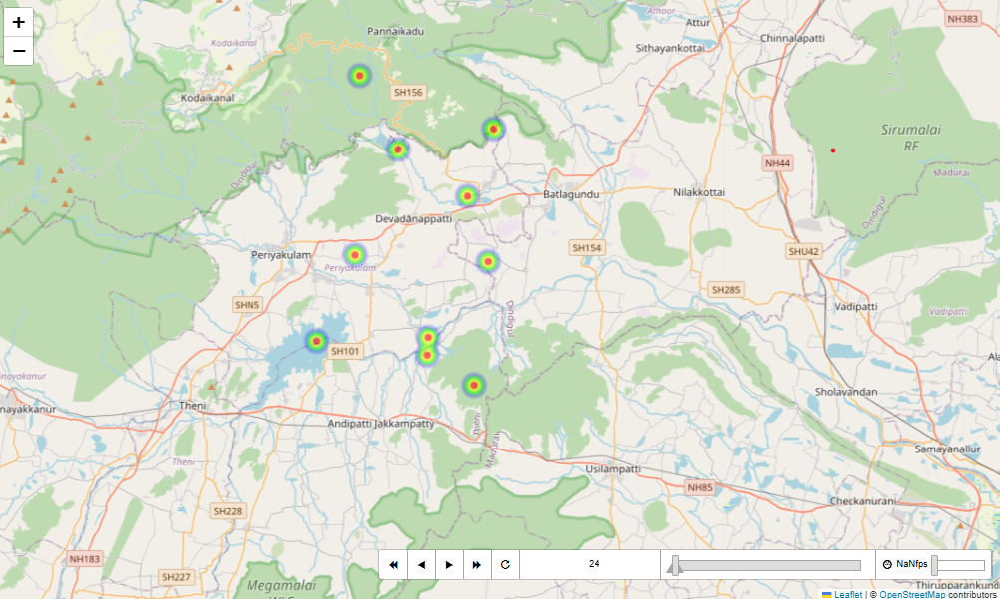

# Pandemic Contact Tracing & Visualization

This project demonstrates **advanced epidemiological contact tracing** and **geospatial analysis** using machine learning and visualization techniques. It leverages clustering algorithms (DBSCAN), spatial datasets, and interactive maps to analyze the spread of infections across the **Theni district region** in Tamil Nadu, India.

---

## 🚀 Features
- **Clustering & Analysis**
  - Uses **DBSCAN** to cluster individuals based on spatial and temporal contact data.
  - Identifies potential infection spread patterns from live geolocation data.
  
- **Geospatial Visualization**
  - Interactive **Leaflet.js/Folium map** (`theni_map.html`) with:
    - Heatmaps
    - Time-based playback of spread
    - Location-based contact clusters
  - Screenshot example:  
    

- **Data Sources**
  - `livedata.json` → Live location & timestamp data of individuals  
  - `livedata.csv` → CSV formatted tracking data  
  - `clustered.csv` → Output of DBSCAN clustering results  

- **Notebook Implementation**
  - `pandamic_project.ipynb` contains the core code for:
    - Data preprocessing  
    - Clustering algorithm  
    - Visualization  

---

## 📂 Project Structure

├── pandamic_project.ipynb # Main Jupyter Notebook

├── theni_map.html # Interactive Map (Leaflet/Folium)

├── theni_map_screenshot.png # Map Screenshot (Preview)

├── livedata.json # Input JSON Dataset

├── livedata.csv # Input CSV Dataset

├── clustered.csv # Output clustered results

├── README.md # Project Documentation

---

## ⚙️ Requirements
- Python 3.x  
- Libraries:
  - `pandas`
  - `numpy`
  - `matplotlib`
  - `seaborn`
  - `folium`
  - `scikit-learn`
  - `tensorflow` (optional, for ML extensions)

Install dependencies:
```bash
pip install pandas numpy matplotlib seaborn folium scikit-learn tensorflow
```

## ▶️ How to Run
Clone the repository:

git clone https://github.com/your-username/pandemic-tracing.git
cd pandemic-tracing

Open the Jupyter Notebook:

jupyter notebook pandamic_project.ipynb

Run the cells step by step to:

Load datasets

Perform clustering

Generate visualizations

To view the interactive map:

Open theni_map.html in your browser

## 📊 Example Output

Clustered Data (clustered.csv) → DBSCAN output with cluster IDs

Heatmap Animation → Time-lapse of infection spread over Theni district

## 🌍 Use Cases

Real-time pandemic monitoring

Contact tracing during outbreaks

Geospatial epidemiology research

## 📜 License

This project is licensed under the MIT License – free to use and modify.

